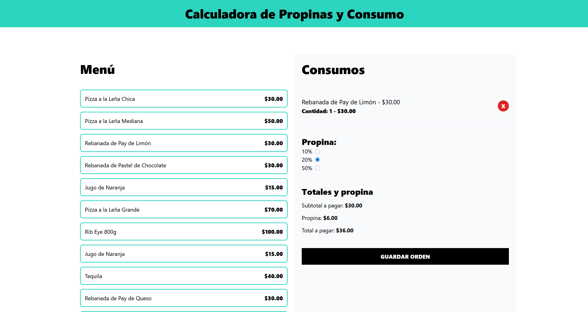

# Correr el proyecto en Desarrollo 

* Ejecutar
  ```
  npm install
  ```
* Luego ejecutar
  ```
  npm run dev
  ```

# Stack de tecnologías
* React
* React Router Dom
* Typescript
* Vite

# Demostración

